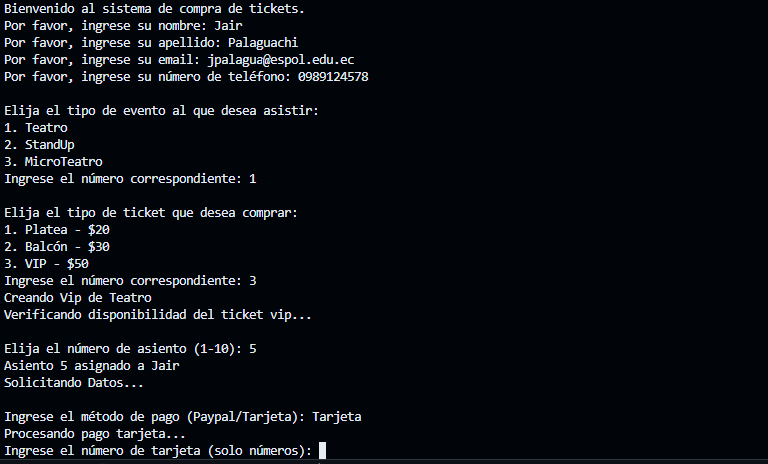

# Mi repositorio personal

Soy estudiante  de Ingeniería en Computación en la Universidad Politécnica Superior del Litoral (ESPOL). Me apasiona el desarrollo de software, la arquitectura de computadores y la resolución de problemas computacionales. A lo largo de mi formación, he adquirido conocimientos en estructuras de datos, bases de datos, diseño de software y programación orientada a objetos. Además, tengo experiencia en lenguajes como C, Java y Python, así como en el uso de herramientas como Android Studio y MySQL.

---

## 📋 Contenido
1. [👤 Sobre mí](#-sobre-mí)
2. [💻 Proyectos destacados](#-proyectos-destacados)
3. [🚀 Tecnologías que utilizo](#-tecnologías-que-utilizo)
4. [🎯 Intereses](#-intereses)
5. [📫 Contacto](#-contacto)

---

## 👤 Sobre mí
- **Nombre:** Jair Palaguachi
- **Ocupación:** Estudiante de ingeniería en computación
- **Ubicación:** Ecuador

---

## 💻 Proyectos destacados
Aquí hay una lista de algunos de mis proyectos más interesantes:

1. **[Proyecto de Base de Datos para una clínica dental](https://github.com/SKEIILAT/proyectoBD.git)**  

   

   _Se desarrolló un proyecto que consitió en la implementación de un programa el cual mediante al acceso a una base de datos de una clínica dental permite el ingreso, eliminación, modificación de datos y generación de reportes, a través de una interfaz amigable para el usuario._  

   **Tecnologías usadas:** Python, MySQL  
   
   **Colaboradores:**  
   - [SKEIILAT](https://github.com/SKEIILAT)  
   - [Juseperez](https://github.com/Juseperez)
   - [LuisRoca09](https://github.com/LuisRoca09)

2. **[Proyecto de Diseño de Software EnVivoTickets](https://github.com/SKEIILAT/Tarea_3_G3_EnVivoTickets.git)**  

   

   _Se desarrolló un proyecto que consitió en la implementación de un programa que simula la compra y venta de tickets para distintos eventos en vivo. Para este proyecto se hizo uso de distintos patrones de diseño para mejorar la escabilidad del programa y a lo largo del mismo se empleó distintas técnicas de refactorización para mejorar la legibilidad del código  ._  

   **Tecnologías usadas:** Java 
   
   **Colaboradores:**  
   - [SKEIILAT](https://github.com/SKEIILAT)  
   - [BrayanBriones](https://github.com/BrayanBriones)
   - [HenryOlvera28](https://github.com/HenryOlvera28)

2. **[Proyecto de Poo - Finanzas Personales](https://github.com/JairPalaguachi/Poo_Finanzas-Personales.git)**  

   

   _Se desarrolló un proyecto que consitió en la implementación de un programa que simula una aplicación que permite al usuario llevar el control de sus finannzas personales al agregar los ingresos y egresos que tiene en un tiempo especificado, y realizar una proyección de sus gastos a futuro.  ._  

   **Tecnologías usadas:** Java 
   
 

---

## 🚀 Tecnologías que utilizo
- Java
- Pyhton
- MySQL
- Android Studio
- C

---

## 🎯 Intereses
-  Desarrollo de software
-  Inteligencia artificial
-  Desarrollo de aplicaciones móviles
-  Desarrollo web

---

## 📫 Contacto
- **Correo electrónico:** [jpalagua@espol.edu.ec](jpalagua@espol.edu.ec)
- **LinkedIn:** [Perfil de LinkedIn](www.linkedin.com/in/jair-palaguachi-08005a277)

